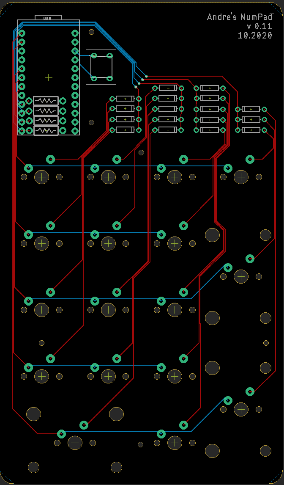

# ProMicro-NumberPad

This is a simple learning project that includes the design for a simple numpad PCB that is designed to work with an Arduino-compatible Sparkfun Pro Micro.
The PCB is designed in Autodesk Eagle, and the C code is written for the Arduino IDE.

## PCB

## License
This project is licensed under the [GNU General Purpose License v3.0](LICENSE).
